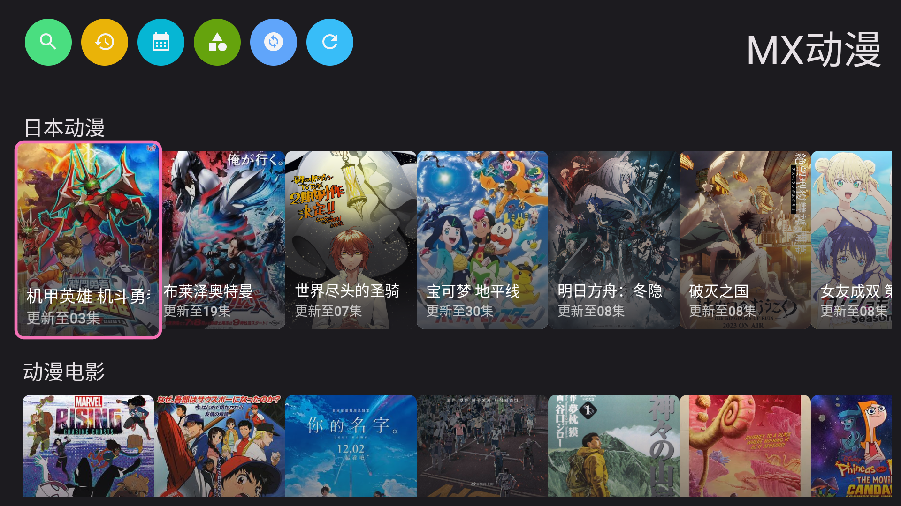
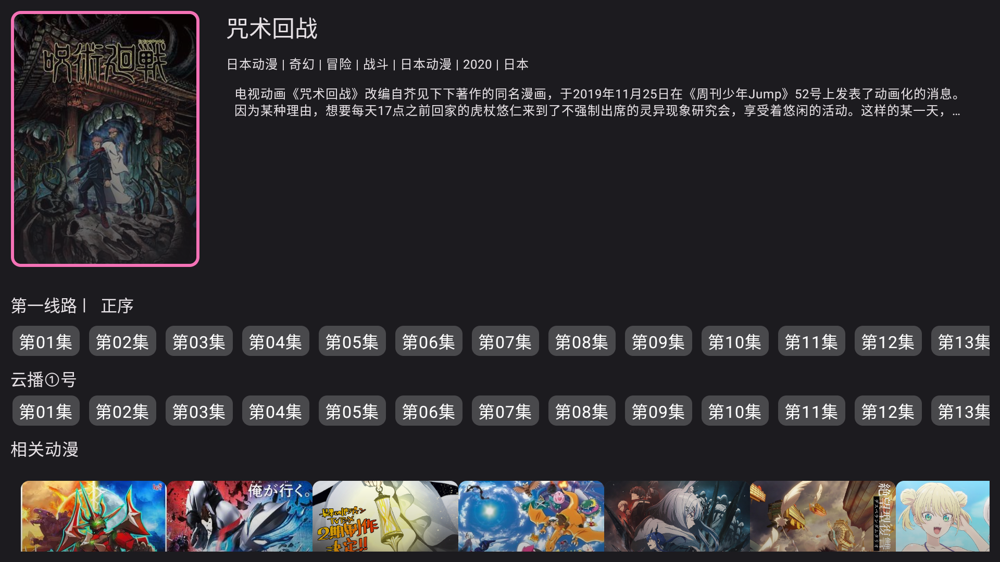
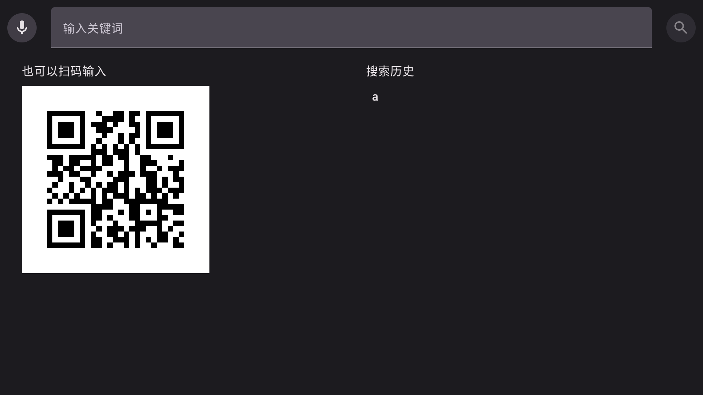

# 次元匣 TV

次元匣 TV 係一個為 Android TV / 電視盒子遙控操作重新整理嘅動漫播放器介面，目標係將常用追番流程做得更直覺、更適合客廳環境。

目前版本重點放喺：
- 繁體中文介面
- Android TV 遙控器操作優化
- 本週更新 / 季度新番 / 劇場番組快速瀏覽
- 播放記錄、搜尋、選集、續播
- 針對電視畫面重新整理嘅播放器介面

## 功能特色

- 首頁直接進入本週更新，方便按星期追番
- 焦點、封面、選集介面針對 DPAD 遙控重新調整
- 內建繁體中文字串與常見簡體內容轉換
- 支援播放記錄與續播
- 保留 Android TV 常用操作邏輯，減少觸控式 UI

## 安裝

1. 到右邊 / 上方的 Releases 頁下載最新 APK
2. 將 APK 安裝到 Android TV 或電視盒子
3. 首次開啟後按需要設定來源與網路

## 截圖

### 首頁

### 詳情與選集

### 搜尋

## 專案說明

- 本專案以 Android TV 使用體驗為優先，屬於客製化公開版本
- 介面、遙控操作、繁體中文、播放器 UI 都有額外調整
- 網站內容與實際可播放狀態會受來源站點、網路環境、區域限制影響

## 致謝與引用

本專案參考並延伸以下第三方公開項目與資源：

- [peacefulprogram/sakura-animation](https://github.com/peacefulprogram/sakura-animation)
- [bloc97/Anime4K](https://github.com/bloc97/Anime4K)

感謝原作者公開相關項目，令 Android TV 動漫播放器方向有更清晰嘅參考基礎。  
本 repo 主要集中喺電視介面整理、遙控操作優化、繁體中文與播放體驗調整。
